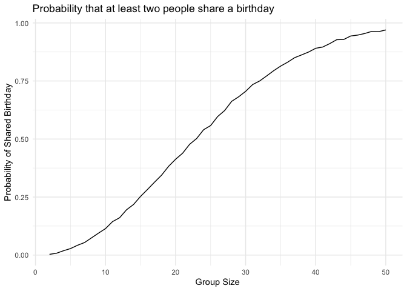

p8105_hw5_mc5698
================
2024-11-12

``` r
library(tidyverse)
```

    ## ── Attaching core tidyverse packages ──────────────────────── tidyverse 2.0.0 ──
    ## ✔ dplyr     1.1.4     ✔ readr     2.1.5
    ## ✔ forcats   1.0.0     ✔ stringr   1.5.1
    ## ✔ ggplot2   3.5.1     ✔ tibble    3.2.1
    ## ✔ lubridate 1.9.3     ✔ tidyr     1.3.1
    ## ✔ purrr     1.0.2     
    ## ── Conflicts ────────────────────────────────────────── tidyverse_conflicts() ──
    ## ✖ dplyr::filter() masks stats::filter()
    ## ✖ dplyr::lag()    masks stats::lag()
    ## ℹ Use the conflicted package (<http://conflicted.r-lib.org/>) to force all conflicts to become errors

``` r
library(rvest)
```

    ## 
    ## Attaching package: 'rvest'
    ## 
    ## The following object is masked from 'package:readr':
    ## 
    ##     guess_encoding

``` r
library(broom)
```

\#Problem 1

``` r
# Run the simulation
birthday_sim = 
  function(n) {
  birthdays <- sample(1:365, n, replace = TRUE)
  return(any(duplicated(birthdays))) 
}
```

``` r
sim_results_df =
  expand_grid(
  group_size = 2:50,
  iter = 1:10000
) |>
  mutate(
    has_shared_birthday = map_lgl(group_size, birthday_sim)
  )
```

``` r
# plot
birthday_prob <- sim_results_df %>%
  group_by(group_size) %>%
  summarize(probability = mean(has_shared_birthday))

ggplot(birthday_prob, aes(x = group_size, y = probability)) +
  geom_line() +
  labs(title = "Probability that at least two people share a birthday",
       x = "Group Size",
       y = "Probability of Shared Birthday") +
  theme_minimal()
```

<!-- -->
This graph shows the probability that at least two people in a group
share the same birthday increases rapidly as the group size grows. About
23 people, there’s already over a 50% chance of a shared birthday, and
when the group reaches 50, the probability is close to 100%.

\#Problem 2

``` r
# Simulation parameters
n <- 30
sigma <- 5
mu_values <- 0:6
n_simulations <- 5000
alpha <- 0.05
```

``` r
#Define function
one_sample_sim = function(mu) {
  x <- rnorm(n, mean = mu, sd = sigma)
  t_test_result <- t.test(x, mu = 0) %>% 
    tidy() %>% 
    select(estimate, p.value)  
  colnames(t_test_result) <- c("mu_hat", "p_value")
  return(t_test_result)
}
```

``` r
#Run the simulation
set.seed(123) 
sim_results_df <- expand_grid(
  mu = 0:6,
  iter = 1:5000
) %>%
  mutate(
    test_results = map(mu, one_sample_sim)
  ) %>%
  unnest(test_results)
```

``` r
power_analysis = sim_results_df %>%
  group_by(mu) %>%
  summarize(
    power = mean(p_value < alpha),
    avg_mu_hat = mean(mu_hat),             
    avg_mu_hat_rejected = mean(mu_hat[p_value < alpha], na.rm = TRUE))
```

``` r
# Plot power as a function of mu
ggplot(power_analysis, aes(x = mu, y = power)) +
  geom_line() +
  labs(title = "Power of One Sample t-Test by Effect Size",
       x = "True Mean (mu)",
       y = "Power") +
  theme_minimal()
```

<!-- -->
This graph shows that as the effect size (true mean) increases, the
power of the one-sample t-test also increases. When μ is close to zero,
the power is low, meaning the test rarely detects a difference. As true
mean increases, the power quickly rises, reaching near certainty around
mu = 4 which shows that larger effect sizes make it more likely for the
test to correctly reject the null hypothesis.

``` r
# Plot the average estimate of 𝜇̂ on the y axis and the true value of 𝜇 on the x axis.
ggplot(power_analysis, aes(x = mu)) +
  geom_line(aes(y = avg_mu_hat, color = "All Samples")) +
  geom_line(aes(y = avg_mu_hat_rejected, color = "Rejected Samples")) +
  labs(title = "Average Estimate of mu_hat by Effect Size",
       x = "True Mean (mu)",
       y = "Average Estimate of mu_hat") +
  scale_color_manual(name = "Legend", values = c("All Samples" = "green", "Rejected Samples" = "blue")) +
  theme_minimal()
```

<!-- -->
The graph shows that the average estimate of mu_hat is higher in samples
where the null was rejected (blue line) compared to all samples (green
line) as mu increases. This occurs because samples with higher means are
more likely to reject the null, creating a positive bias in the rejected
samples. Therefore, the average estimate in rejected samples does not
equal the true mean.

\#Problem 3

``` r
#Load dataset
homicides <- read_csv("homicide-data.csv")
```

    ## Rows: 52179 Columns: 12
    ## ── Column specification ────────────────────────────────────────────────────────
    ## Delimiter: ","
    ## chr (9): uid, victim_last, victim_first, victim_race, victim_age, victim_sex...
    ## dbl (3): reported_date, lat, lon
    ## 
    ## ℹ Use `spec()` to retrieve the full column specification for this data.
    ## ℹ Specify the column types or set `show_col_types = FALSE` to quiet this message.

``` r
homicides
```

    ## # A tibble: 52,179 × 12
    ##    uid        reported_date victim_last  victim_first victim_race victim_age
    ##    <chr>              <dbl> <chr>        <chr>        <chr>       <chr>     
    ##  1 Alb-000001      20100504 GARCIA       JUAN         Hispanic    78        
    ##  2 Alb-000002      20100216 MONTOYA      CAMERON      Hispanic    17        
    ##  3 Alb-000003      20100601 SATTERFIELD  VIVIANA      White       15        
    ##  4 Alb-000004      20100101 MENDIOLA     CARLOS       Hispanic    32        
    ##  5 Alb-000005      20100102 MULA         VIVIAN       White       72        
    ##  6 Alb-000006      20100126 BOOK         GERALDINE    White       91        
    ##  7 Alb-000007      20100127 MALDONADO    DAVID        Hispanic    52        
    ##  8 Alb-000008      20100127 MALDONADO    CONNIE       Hispanic    52        
    ##  9 Alb-000009      20100130 MARTIN-LEYVA GUSTAVO      White       56        
    ## 10 Alb-000010      20100210 HERRERA      ISRAEL       Hispanic    43        
    ## # ℹ 52,169 more rows
    ## # ℹ 6 more variables: victim_sex <chr>, city <chr>, state <chr>, lat <dbl>,
    ## #   lon <dbl>, disposition <chr>

``` r
summary(homicides)
```

    ##      uid            reported_date       victim_last        victim_first      
    ##  Length:52179       Min.   : 20070101   Length:52179       Length:52179      
    ##  Class :character   1st Qu.: 20100318   Class :character   Class :character  
    ##  Mode  :character   Median : 20121216   Mode  :character   Mode  :character  
    ##                     Mean   : 20130899                                        
    ##                     3rd Qu.: 20150911                                        
    ##                     Max.   :201511105                                        
    ##                                                                              
    ##  victim_race         victim_age         victim_sex            city          
    ##  Length:52179       Length:52179       Length:52179       Length:52179      
    ##  Class :character   Class :character   Class :character   Class :character  
    ##  Mode  :character   Mode  :character   Mode  :character   Mode  :character  
    ##                                                                             
    ##                                                                             
    ##                                                                             
    ##                                                                             
    ##     state                lat             lon          disposition       
    ##  Length:52179       Min.   :25.73   Min.   :-122.51   Length:52179      
    ##  Class :character   1st Qu.:33.77   1st Qu.: -96.00   Class :character  
    ##  Mode  :character   Median :38.52   Median : -87.71   Mode  :character  
    ##                     Mean   :37.03   Mean   : -91.47                     
    ##                     3rd Qu.:40.03   3rd Qu.: -81.76                     
    ##                     Max.   :45.05   Max.   : -71.01                     
    ##                     NA's   :60      NA's   :60

The raw dataset has 52,179 records from U.S. cities, detailing
individual homicides from January 1, 2007, to November 5, 2015. Each
record includes the unique identifier (uid), report date, victim details
(name, race, age, and gender), and the city and state. Moreover,
latitude and longitude coordinates provide precise location data.

``` r
#Define city_state variable
unsolved_cases <- c("Closed without arrest", "Open/No arrest")

homicides <- homicides %>%
  mutate(city_state = paste(city, state, sep = ", ")) %>%  
  group_by(city_state) %>%
  summarize(
    total_homicides = n(),
    unsolved_homicides = sum(disposition %in% unsolved_cases)
  ) %>%
  ungroup()
homicides
```

    ## # A tibble: 51 × 3
    ##    city_state      total_homicides unsolved_homicides
    ##    <chr>                     <int>              <int>
    ##  1 Albuquerque, NM             378                146
    ##  2 Atlanta, GA                 973                373
    ##  3 Baltimore, MD              2827               1825
    ##  4 Baton Rouge, LA             424                196
    ##  5 Birmingham, AL              800                347
    ##  6 Boston, MA                  614                310
    ##  7 Buffalo, NY                 521                319
    ##  8 Charlotte, NC               687                206
    ##  9 Chicago, IL                5535               4073
    ## 10 Cincinnati, OH              694                309
    ## # ℹ 41 more rows

``` r
#Use the prop.test function to estimate the proportion of homicides that are unsolved
baltimore_data <- homicides %>%
  filter(city_state == "Baltimore, MD")

baltimore_test = prop.test(baltimore_data$unsolved_homicides,
                           baltimore_data$total_homicides)
baltimore_results = 
  tidy(baltimore_test) %>%
  select(estimate, conf.low, conf.high) %>%
  rename(
    proportion_unsolved = estimate,
    conf_low = conf.low,
    conf_high = conf.high
  )
baltimore_results
```

    ## # A tibble: 1 × 3
    ##   proportion_unsolved conf_low conf_high
    ##                 <dbl>    <dbl>     <dbl>
    ## 1               0.646    0.628     0.663

``` r
#Run prop.test for each city
city_proportions <- homicides %>%
  mutate(
    test = map2(unsolved_homicides, total_homicides, ~ binom.test(.x, .y)),
    test_summary = map(test, broom::tidy)
  ) %>%
  unnest(test_summary) %>%
  select(city_state, estimate, conf.low, conf.high)
```

``` r
# Order cities by proportion
city_proportions <- city_proportions %>%
  arrange(desc(estimate))

# Plotting
ggplot(city_proportions, aes(x = reorder(city_state, estimate), y = estimate)) +
  geom_point() +
  geom_errorbar(aes(ymin = conf.low, ymax = conf.high), width = 0.2) +
  labs(
    title = "Proportion of Unsolved Homicides by City",
    x = "City",
    y = "Proportion of Unsolved Homicides"
  ) +
  theme_minimal() +
  coord_flip()
```

<!-- -->
The graph shows the proportion of unsolved homicides across U.S. cities,
with error bars indicating confidence intervals. There is wide
variation, with some cities below 25% unsolved and others nearing 75%
which highlights disparities in case resolution rates.
